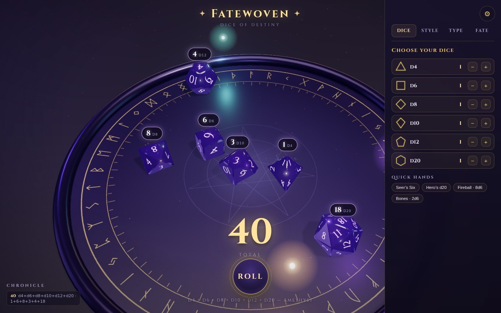
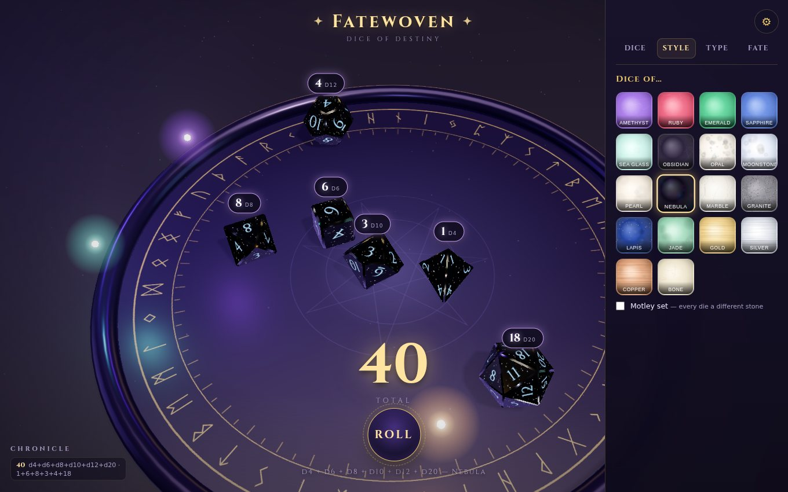
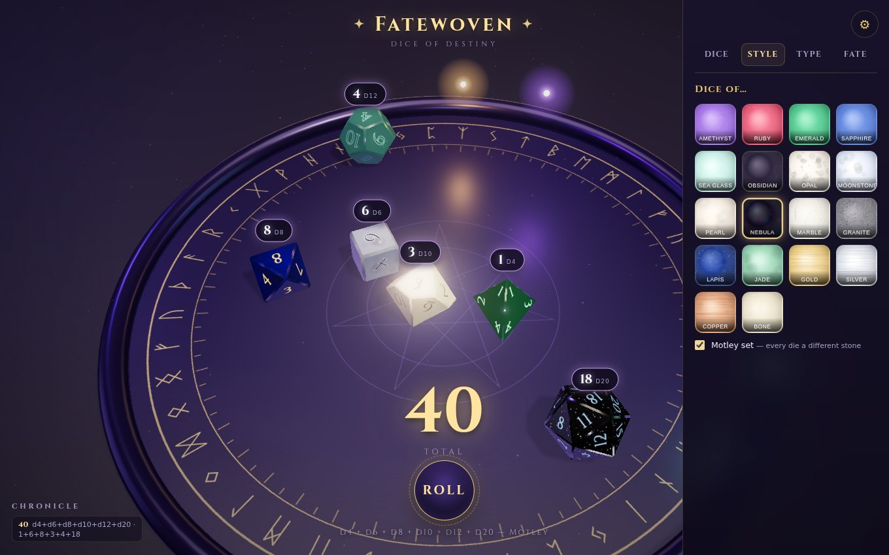

# ✦ Fatewoven — dice of destiny ✦

A magical 3D dice roller. Real tumbling physics, dice cut from amethyst, nebula,
gold and fifteen other stones, and a thread of fate woven from three questions
only you can answer.



## What it does

- **Real rolls.** Every die is a true convex polyhedron (d4, d6, d8, d10, d12, d20)
  simulated with rigid-body physics — thrown, tumbling, clattering off the tray
  wall and each other until it comes to rest. The result is read from whichever
  face physically lands up (the d4 reads its top corner, like the real thing).
- **The Ritual of Seeds.** Three whimsical questions — *how many lights shine in
  your room? what did you eat for lunch? whisper a word of power* — are hashed
  into the PRNG stream that drives every throw. The same three answers always
  weave the same sequence of rolls; change one answer and destiny changes. Your
  answers also mint a personal rune sigil.
- **Twenty-six stones.** Amethyst, ruby, emerald and sapphire cut as clear
  jewels; dichroic glass, clear quartz, rose quartz and fluorite; labradorite's
  blue flash, tiger's eye, malachite, turquoise, sea glass, obsidian, opal,
  moonstone, pearl, nebula, marble, granite, lapis, jade, gold, silver, copper
  and bone — built on physically-based transmission, iridescence, clearcoat and
  emissive starfields. Or flip on **Motley set** to give every die its own
  stone.
- **Typography you can tune.** Five numeral scripts (embedded Cinzel and Uncial
  Antiqua, plus system serif/sans/mono), size, weight, seven inks, glowing
  numerals, and the classic underline that disambiguates 6 from 9 — with a live
  preview.
- **A magical table.** Rune ring that surges while the dice fly, orbiting wisp
  lights, drifting dust motes, impact sparks, bloom, and a settle chime — plus
  floating result chips pinned above each die, a counted-up total, crit/fumble
  flourishes for natural 20s and 1s, and a chronicle of recent rolls.
- **Sound, synthesized.** Every impact is modal — a handful of damped sinusoids
  at inharmonic ratios, pitched by die size, which is what gives a struck solid
  its material. Bells ring on real cast-bell partials with the low ones voiced
  as detuned pairs, so they shimmer. All of it runs through a procedurally
  generated convolution reverb. No audio files anywhere. Mutable under Fate.

| Nebula stone | Motley set |
| --- | --- |
|  |  |

## Run it

```bash
npm install
npm run dev        # local dev server
npm run build      # single self-contained dist/index.html
```

The production build inlines everything (code, styles, fonts) into one
`dist/index.html` that runs from anywhere — a file:// open, a static host, or
an artifact page — with zero external requests.

## The iOS app

The repo ships a ready-to-build native iOS project (`ios/`) — a Capacitor 8
wrapper (Swift Package Manager, no CocoaPods) around the same app, with:

- **native haptics** — a tick for every die impact, medium thumps for hard
  hits, success/error taps for natural 20s and 1s;
- full-bleed rendering under the notch / Dynamic Island with safe-area-aware
  UI, scroll and bounce disabled, light status bar over the dark table;
- the glowing d20 app icon and a dark launch screen
  (regenerate any time with `npm run icons`).

On a Mac with Xcode 15+:

```bash
npm install
npm run ios        # = vite build + cap sync ios + cap open ios
```

Then select your signing team under *Signing & Capabilities* and press Run —
simulator or device. Requires iOS 15+ (the gems need WebGL2, which WKWebView
enables from iOS 15). The bundle id defaults to `com.kinsort.fatewoven` —
change it in `capacitor.config.json` and Xcode signing if you ship it.

**No Mac handy?** Fatewoven is also an installable PWA: host `dist/` over
https, open it in Safari on the iPhone, then **Share → Add to Home Screen**.
Full screen, offline-capable (service worker), same dice — just without the
native haptics.

**Controls:** click **Roll**, press **Space**, or tap the tray. The ⚙ opens the
panel: **Dice** (loadout + presets), **Style** (stones, Motley, and the wisp
lights — orbiting glows above the tray, off by default), **Type** (numerals),
**Fate** (the three seed questions + sound). Settings persist locally.

## How the pieces work

- `src/dice/geometry.js` — the six solids are discovered from raw vertex sets by
  supporting-plane enumeration, so one code path yields every polyhedron
  (including the d10's pentagonal trapezohedron, whose ring offset
  `c = (1−cos 36°)/(1+cos 36°)` makes its kite faces exactly planar). Faces are
  chamfered for jewel-like edges; opposite faces sum to n+1 like real dice.
- `src/physics.js` — cannon-es world with a fixed 1/120 s timestep and an
  accumulator, so a given seed always replays the same roll regardless of frame
  rate. A deterministic "felt" drag inside the fixed step stops near-spherical
  dice from orbiting the tray like roulette balls (rigid-body sims have no
  rolling resistance), and a containment constraint beside it keeps dice in the
  dish — cannon-es resolves convex-vs-box contacts unreliably once dice stack
  against the wall, so without it they creep straight through. `npm run
  containment` replays 300 crowded rolls and asserts nothing escapes.
- `src/rng.js` — cyrb128 hashes the three answers into an sfc32 stream; only
  roll mechanics draw from it. Cosmetics (sparks, wisps) use `Math.random`, so
  the pretty things never disturb destiny.
- `src/dice/materials.js` + `src/dice/faces.js` — per-face canvas textures:
  procedural stone patterns, numerals in the chosen typography, glow via
  emissive maps (dark "engraved" inks deliberately don't glow), and
  transmission maps so painted numerals stay opaque on glass gems.
- `scripts/` — headless Playwright harness: `npm run verify` replays a seed and
  asserts the rolls are identical (plus settle timing and chip placement);
  `npm run shots` captures the screenshot tour; `npm run icons` re-renders the
  app icon and splash from `scripts/icon.html`.

Embedded fonts (Cinzel, Uncial Antiqua) are SIL OFL licensed, subset to latin,
inlined as data URIs.
